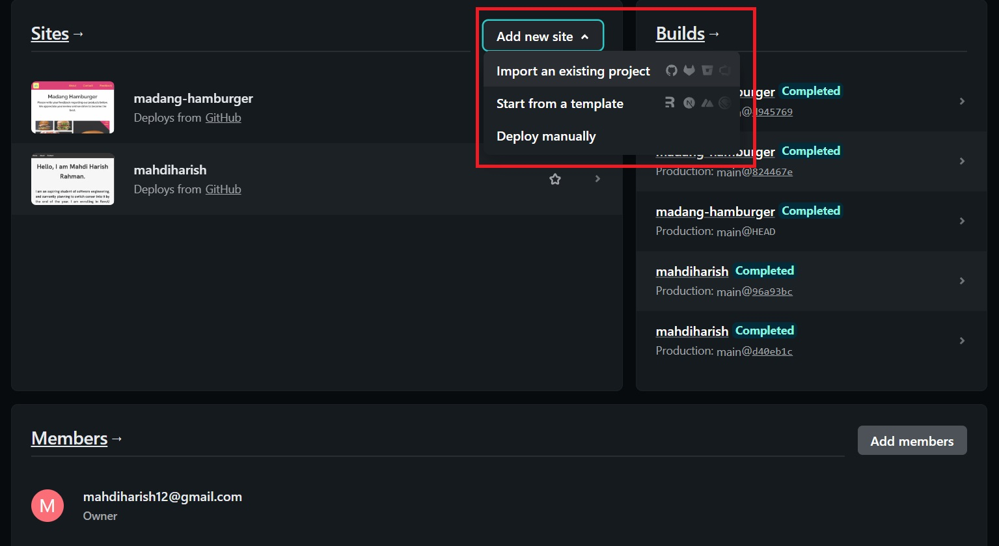

# WEBSITE DEPLOYMENT & CUSTOM DOMAIN USING PERSONAL WEBSITE

### Hello!

This readme file will be used to document whole process of deploying website using Netlify, creating a custom domain for our personal website, and connecting it through Cloudflare to add layer of protection for our website. For my custom domain, I will be using one from Niagahoster.

For this project, I will be using my own personal website that has been created for Week 1 project.

[Personal Website](https://mahdiharish.netlify.app/)

This is my personal website with URL using Netlify.

[Personal Website with Custom Domain]()

This is my personal website with custom domain URL.

## HOW TO DEPLOY WEBSITE USING NETLIFY

1. Sign up/log in with Netlify. I am using my email for this, and then connect my Github repository later.

2. After logging in, you will be directed to team overview's page where you can review your work within Netlify.

To deploy our website, we will need to click

> Add new site

which is highlighted in picture below.

There will be few options available, but for now we will deploy it by importing existing projects that we have already done in our GitHub repository.

3. Based from Netlify, there are 3 steps available for this, which can be reviewed below.

For this, we can choose GitHub account since we are using GitHub for our repository. You need to authorize your account to GitHub so you can use it.

After that, we can choose which account and repository that will be deployed. You can search the repository by using parts of repository name. It is pretty easy.

Now, we can set up our website before we deploy it. There isn't much to do for now beside setting our branch into main for display.

You will be redirected to your website overview page, where you can review many things, including changing your website's name. However, this step is optional for now as we will be using custom domain. What previewed here is my past work before, so I have changed the website's name before. Initially the website name will be generated randomly.

## SETTING UP CUSTOM DOMAIN

1. For this step, we need to purchase our own custom domain name. I am using Niagahoster for this reason for few reasons:

- Cheap and affordable,
- Plenty of options available,
- Reputable for its service since it's been around for quite long time in Indonesia.

2. You need to sign up/log in with Google Account for using Niagahoster service. It is pretty simple and straightforward step.

3. Later, we can choose which service we need. Choose **Domain** by clicking **Order Sekarang**

4. Next, we can pick what domain name we like. Choose what's available and its prices to our preference. You can also check if the domain's name is still available or not.

Afterwards, choose what we want and proceed to purchase it.

5. Complete purchase in this page.

6. After we complete our purchase and review it, we can proceed to our domain page in Niagahoster's website, which looks like this.

Now, we can proceed to Cloudflare to add layer of security protection for our website.

## SETTING UP CLOUDFLARE

1. Go to Cloudflare website and sign up/log in our account to start working.

2. After logging in, we will be redirected to our account's dashboard.

3. Add our previously purchased domain's name at **Add site** above, and then enter our domain's name

4. Select plan for the website. Choose free one and click **Continue**.

5. After completing our selection, you need to complete your name server setup. Just skip steps after choosing plans and then go to **Overview** page for more details.

Copy Cloudflare's nameservers and paste it to Niagahoster's overview domain page.

And then replace Niagahoster's nameservers with Cloudflare ones.

Please note that updating nameservers can take time up to 24 hours, so we need to wait for now. We can still proceed to next steps.

6. Now, we need to set up our DNS Record. Go to DNS tab on the left, and then choose DNS Management section. Click **Add Record**, and then choose CNAME for the type, and make the **Name** section _@_ and _www_, and then fill the **Target** section with our Netlify page.

Afterwards, we can proceed to our Netlify page to set up our custom domain page.

## SETTING UP CUSTOM DOMAIN IN NETLIFY

1. Go to our website page in Netlify, and then click **Set up a custom domain**.

2. Fill our custom domain purchased before, and then click **Verify**. Afterwards, click **Add domain**.

3. You can check the custom domain's settings here. Afterwards your website with custom domain should be able to go live now.

